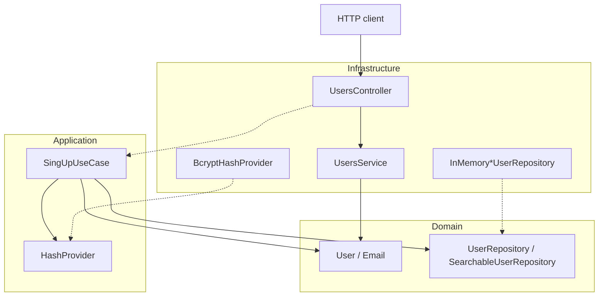

# ti-syscalls-backend

Backend for an IT support ticket system. Organizations should be able to register people, assign roles, and eventually open and track technical support requests.

This repository is a study project. The goal is not a finished helpdesk product. It is a realistic NestJS/TypeScript backend used to practice Domain-Driven Design, Clean Architecture, and the kind of engineering decisions those ideas force once the code starts growing.

The first bounded context in place is **Users**. Ticket management is the intended product, but it is not implemented yet.

**Status:** early development (`0.0.1`). Experimental. Not a production deployment.

## Context

A support desk needs more than a ticket table. People sign up, emails have to be valid and unique, passwords cannot be stored in plain text, and roles change what someone is allowed to do later (`user`, `technician`, `admin`).

That is the slice this backend currently models. HTTP exists as a NestJS REST API. Persistence is still in-memory. The signup use case already encodes the user-registration rules, even though it is not wired to a controller yet.

Who this code is for today:

- people who will become requesters, technicians, or admins;
- developers studying how a NestJS app can keep domain rules out of controllers and database adapters.

## Features

What the code actually does today:

- **User domain model** — identity, name, email, password, and role (`user`, `technician`, `admin`).
- **User registration rules** — `SingUpUseCase` validates required fields, normalizes email, rejects duplicates, hashes the password, and inserts the user through a repository port.
- **Email as a value object** — trim, lowercase, format check, value equality.
- **Password hashing** — `HashProvider` port with a `bcryptjs` adapter (cost factor 12).
- **In-memory user persistence** — insert, find by id/email, list, update, delete.
- **Searchable users** — filter by query (name or email), name, email, and role; sort by `name`, `email`, or `role`; paginate (default page `1`, per page `15`).
- **Users HTTP resource** — NestJS `UsersController` under `/users`. `POST /users` creates a `User` through the domain factory. `GET`, `PATCH`, and `DELETE` are still generated stubs.

What is **not** implemented:

- ticket/syscall lifecycle;
- authentication or authorization;
- PostgreSQL or any other database;
- Docker;
- OpenAPI/Swagger.

## Tech stack

Confirmed from `package.json` and source:

| Area | Choice |
| ---- | ------ |
| Language | TypeScript |
| Runtime | Node.js |
| HTTP framework | NestJS 11 (`@nestjs/platform-express`) |
| API style | REST |
| Password hashing | `bcryptjs` |
| Tests | Jest, ts-jest, Supertest |
| Lint / format | ESLint, Prettier |

There is no ORM, migration tool, or container setup in this repository.

## Architecture

The problem this structure tries to solve is coupling. If user rules live in a NestJS service that talks to Express DTOs and a database at the same time, changing storage, hashing, or HTTP shape starts rewriting business logic.

The code is organized so that:

1. **Domain** owns the rules and the language of the model.
2. **Application** orchestrates use cases against domain ports.
3. **Infrastructure** adapts NestJS, in-memory storage, and bcrypt to those ports.

Presentation is not a separate top-level folder. HTTP controllers and the NestJS `UsersService` live under `infrastructure`, which is how NestJS modules are currently composed.



`UsersService` is a NestJS provider in infrastructure — the path the controller actually calls. Application logic for signup lives in `SingUpUseCase`, which is implemented and tested, but `UsersModule` does not register it yet. The dashed arrow is the intended flow, not the current HTTP wiring.

### How dependencies flow

- `src/users/domain` does not import NestJS, bcrypt, or HTTP types.
- Shared repository ports in `src/shared/domain/repositories` only talk about entities, ids, filters, and pagination.
- Application code depends on those ports, not on a storage engine.
- Infrastructure implements the ports: `InMemoryUserRepository`, `InMemorySearchableUserRepository`, `BcryptHashProvider`.
- NestJS stays at the edges: `AppModule`, `UsersModule`, controllers, and `UsersService`.

That is the dependency rule in practice: domain does not know how it is stored or exposed.

### Bounded context

Only one context exists: **Users**, under `src/users`. Shared kernel code lives in `src/shared` (repository contracts, `DomainError`, `HashProvider`).

`UserRole.TECHNICIAN` is a hint of the support-desk domain that is still missing. There is no tickets module.

## Project structure

```text
src/
├── main.ts
├── app.module.ts
├── shared/
│   ├── application/providers/     HashProvider port
│   └── domain/
│       ├── global-contract.error.ts
│       └── repositories/          Repository, SearchableRepository
└── users/
    ├── application/
    │   ├── errors/
    │   └── use-cases/             SingUpUseCase
    ├── domain/
    │   ├── entities/              User, UserRole
    │   ├── errors/
    │   ├── repositories/          UserRepository, SearchableUserRepository
    │   └── value-objects/         Email
    └── infrastructure/
        ├── dto/
        ├── providers/hash-provider/
        ├── repositories/          in-memory adapters
        ├── users.controller.ts
        ├── users.service.ts
        └── users.module.ts
```

Tests sit next to the code they cover, usually under `__tests__/unit`. End-to-end tests live in `test/`.

## Domain concepts

Only concepts that exist in the code are listed here.

### Entity — `User`

`User` is the user aggregate in practice, even though the class is not labeled as an aggregate root.

It owns:

- a UUID generated with `crypto.randomUUID()`;
- `name`;
- `Email`;
- `password`;
- `UserRole` (`user` | `technician` | `admin`, default `user`).

Behavior stays on the entity: `User.create()`, `updateName()`, `updateEmail()`, `assignRole()`, `hasPassword()`. Name is trimmed. Invalid emails never enter the model.

### Value object — `Email`

`Email` is created only through `Email.create(raw)`. It trims, lowercases, rejects empty values, validates format, and compares by value (`equals`).

### Repository ports

Shared ports:

- `Repository<TEntity, TId>` — `insert` and `findById` only. Update, delete, and aggregate-specific queries stay on the aggregate contract, because failure rules are not the same for every entity.
- `SearchableRepository<TEntity, TFilter, TSortField>` — search, pagination, and ordering. It does **not** extend `Repository`. A searchable read model should be allowed to exist without writes or identity lookup.

User ports:

- `UserRepository` extends `Repository<User, string>` and adds `findAll`, `findByEmail`, `update`, `delete`.
- `SearchableUserRepository` extends both `UserRepository` and `SearchableRepository`. `UserFilter` supports `query`, `name`, `email`, and `role`. Sortable fields are `name`, `email`, and `role`.

Adapters live in infrastructure. They implement the contracts; they do not define them.

### Use case — `SingUpUseCase`

Application-layer registration:

1. reject missing `name`, `email`, or `password`;
2. create an `Email` value object;
3. reject an email that already exists (`findByEmail`);
4. hash the password through `HashProvider`;
5. create a `User` and `insert` it;
6. return `{ id, name, email, role }` without the password.

This use case is covered by unit tests. It is not bound to `UsersController`.

### Ports / providers

- `HashProvider` (`generateHash`, `compareHash`) in `src/shared/application/providers`.
- `BcryptHashProvider` in users infrastructure.

### DTOs

`CreateUserDto` and `UpdateUserDto` live in infrastructure. They are HTTP input shapes, not domain types. `UpdateUserDto` repeats the create fields as optional.

### Errors

- `DomainError` — shared base error with optional `details`.
- `BadRequestException` — used by `SingUpUseCase` for missing fields and duplicate emails.
- `UsersAlreadyExistError` — defined, not used by the signup flow yet.

There are no domain events and no dedicated domain services.

## API

No Swagger. NestJS listens on `process.env.PORT` or **3000**.

### `GET /`

Health/hello endpoint from the Nest starter.

**Response:** `200` with body `Hello World!`

```bash
curl http://localhost:3000/
```

### `POST /users`

Creates a `User` via `UsersService.create` → `User.create`. It does **not** run `SingUpUseCase`: no repository insert, no password hash, no uniqueness check.

**Body:**

```json
{
  "name": "Jane Doe",
  "email": "jane.doe@example.com",
  "password": "secret",
  "role": "user"
}
```

`role` is optional. Allowed values: `user`, `technician`, `admin`.

**Response:** `{ id, name, email, role }` (no password). Email is normalized. Invalid emails throw from the domain.

```bash
curl -X POST http://localhost:3000/users \
  -H "Content-Type: application/json" \
  -d '{"name":"Jane Doe","email":"jane.doe@example.com","password":"secret"}'
```

### `GET /users`

Stub. Returns the string `This action returns all users`.

### `GET /users/:id`

Stub. `:id` is parsed with `+id` (number). Returns `This action returns a #{id} user`.

### `PATCH /users/:id`

Stub. Body is `UpdateUserDto` (any subset of create fields). Returns a string describing the update.

### `DELETE /users/:id`

Stub. Returns `This action removes a #{id} user`.

Search (`SearchableUserRepository.search`) is not exposed over HTTP.

## Persistence

There is no database in this project.

Users are kept in process memory:

- `InMemoryUserRepository` implements `UserRepository`;
- `InMemorySearchableUserRepository` extends it and implements `SearchableUserRepository`.

Data is lost when the process stops. That is enough to test repository contracts and use cases without coupling them to SQL.

## Running locally

### Prerequisites

- Node.js 20+ (NestJS 11)
- npm

### Install

```bash
npm install
```

### Development

```bash
npm run start:dev
```

Watch mode. Default URL: `http://localhost:3000`.

Other start scripts:

```bash
npm run start          # nest start
npm run start:debug    # nest start --debug --watch
```

### Production build

```bash
npm run build
npm run start:prod
```

`start:prod` runs `node dist/main`.

### Lint and format

```bash
npm run lint
npm run format
```

There is no Docker setup and no migration command.

## Environment variables

There is no `.env.example`. The only variable read in source is:

| Variable | Description | Required |
| -------- | ----------- | -------- |
| `PORT` | HTTP port. Defaults to `3000`. | no |

`.gitignore` ignores `.env*` files, but the app does not load a dotenv file on its own.

## Tests

Jest is configured in `package.json` (`rootDir: src`, files matching `.*\.spec\.ts$`). E2E uses `test/jest-e2e.json`.

```bash
npm test           # unit tests
npm run test:watch
npm run test:cov
npm run test:e2e
npm run test:debug
```

Where tests live:

| Area | Location |
| ---- | -------- |
| User entity | `src/users/domain/entities/__tests__/unit` |
| Email VO | `src/users/domain/value-objects/__tests__/unit` |
| Search contracts | `src/shared/domain/repositories/__tests__/unit` |
| User repository ports | `src/users/domain/repositories/__tests__/unit` |
| In-memory adapters | `src/users/infrastructure/repositories/__tests__/unit` |
| `SingUpUseCase` | `src/users/application/use-cases/__tests__/unit` |
| `BcryptHashProvider` | `src/users/infrastructure/providers/hash-provider/__tests__/unit` |
| Nest controller/service | `src/users/infrastructure/__tests__` |
| E2E (`GET /`) | `test/app.e2e-spec.ts` |

Domain and use-case tests talk to in-memory repositories and, for signup, a fake hash provider. They do not boot HTTP except for the Nest-generated controller/service specs and the e2e hello-world test.

## Architectural decisions

**DDD, but only where it pays rent.** Users already have invariants (email format, default role, name trimming). Those rules sit on `User` and `Email`, not in the controller. Tickets are not modeled yet, so there is no fake ubiquitous language around them.

**Clean Architecture as a dependency rule, not a folder religion.** Domain contracts stay in domain directories. Storage and bcrypt stay in infrastructure. Shared search/pagination types stay generic; `UserFilter` stays in the users context so the shared port never learns what a user is.

**Repository is not a generic CRUD.** `Repository` only has `insert` and `findById`. Search is a separate port. That keeps a read-only search implementation possible and stops every aggregate from inheriting the same update/delete semantics.

**Hashing is an application port.** `SingUpUseCase` depends on `HashProvider`, not bcrypt. `BcryptHashProvider` is the adapter. Signup tests inject a fake provider and assert the stored password is the hash, not the raw input.

**In-memory first.** An in-memory adapter is enough to lock repository and use-case behavior. A SQL adapter can implement the same ports later without rewriting `User` or `SingUpUseCase`.

**NestJS is the delivery mechanism.** Modules and controllers compose the app. The domain layer can be unit-tested without creating a Nest testing module.

Current gaps that follow from those choices, not from a different architecture:

- `UsersModule` does not bind repository or hash-provider implementations.
- `UsersService` does not persist and does not call `SingUpUseCase`.

## Roadmap

Nothing here is scheduled. It is just what the code is already leaning toward:

- wire `SingUpUseCase` (and later other use cases) to HTTP;
- replace in-memory storage with a real database behind the same ports;
- expose user search over the API;
- introduce the tickets/syscalls bounded context that the repository name points to.

## License

MIT. See [LICENSE](LICENSE).
